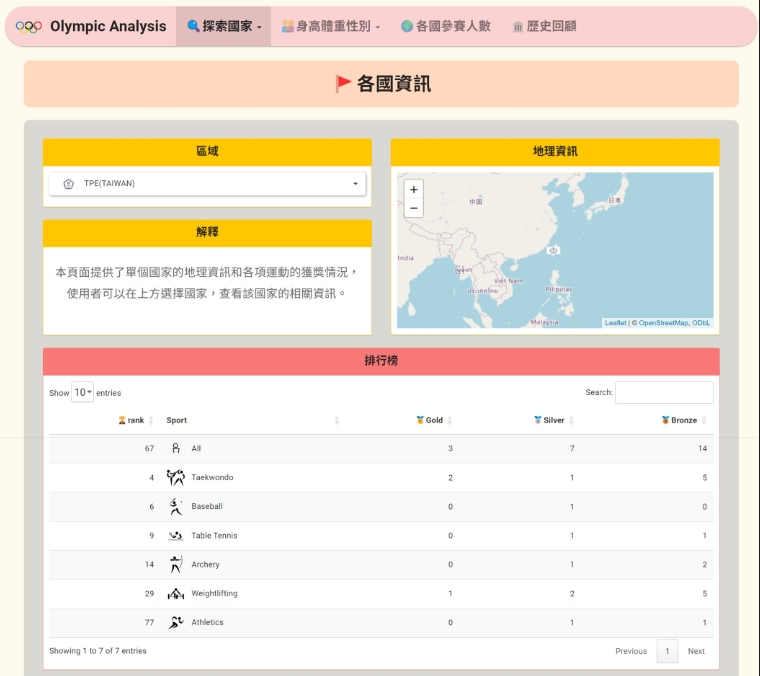

# 奧運大數據資料分析
## 1. 資料來源
- [奧運資料](https://www.kaggle.com/heesoo37/120-years-of-olympic-history-athletes-and-results)
- [運動圖片](https://zh.wikipedia.org/wiki/%E5%A5%A5%E6%9E%97%E5%8C%B9%E5%85%8B%E8%BF%90%E5%8A%A8%E4%BC%9A%E6%AF%94%E8%B5%9B%E9%A1%B9%E7%9B%AE)
- [國家圖片](https://en.wikipedia.org/wiki/List_of_IOC_country_codes#Obsolete_codes)
## 2. 使用技術
1. R shiny
2. css
3. html
4. d3.js
## 3. 成果
- [網站](https://mke0108.shinyapps.io/main_final_project/)

